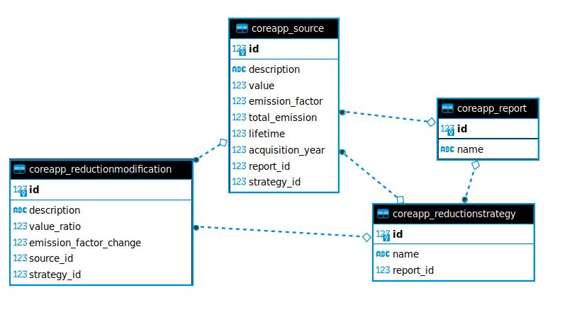

# Decisions log and points for improvement

This document contains all the choices that have been made in the implementation of this case and points for improvement.

## Business decisions

### Time allocation
The most crucial choice -> How to allocate and prioritise time? Two main decisions were made:
* No discussion of decisions: To save time, all decisions were made without discussion with the team/client, a methodology that will never be applied in a real development team.
* Going wide instead of deep: To show a maximum of knowledge area, many topics were introduced in this case but only superficially. (For example, an API access point has been set up but the documentation is very limited). From this point of view, it was also chosen to spend time on the good practices of a project (setting up a CI pipeline, containerisation of the application, ...) and thus to limit the development of project functionality. Again, in a real context, quality over quantity.

### Model

* A report represents a company whose carbon footprint I want to calculate
* A report contains all the emission sources of this company, for all years. The year can be specified in the API queries, at which point the report is calculated for a year. This was chosen because a source can cover many years. (The date value has been removed from the report table to follow this logic)
* A report can contain several reduction strategies
* A reduction strategy can contain several source modifications and can contain new sources

Limits of the current model:
* Only possible to make apply one simple modification to a source : change to EF and ratio to value. Has it is possible to have way more creativity in source modification it was chosen to have the simplest version for a case, and let extension as a discussion topic
* The given data model was very permissive with many nullable fields. It was kept as it was, but it should be noted that this resulted in checks to be made in the code. Some non-exhaustive ideas of constraints to add:
	* If lifetime is set, must have acquisition_year
	* if value x emission_factor = total_emission, why store total emission? May lead to data inconsistency if value, emission_factor and total_emission can be defined independently.
	* ...

Possible extensions of the current model :
* Add a table with sources from the Emissions Factors database and add a reference for the current Source table. The source will then contain only the value and the aquision_year. A similar system could be done for the modifications 
* The abstraction of the source and modification would allow the addition of a tagging system to help match the source and modification for that source.

These ideas will not be further developed in this document as it seems that these solutions are already present at Tapio https://www.tapioview.com/tapio/carbon-strategy-page/4002/#action-plan

### Features list 
Implemented features: 
* Allow to plan a modification to a source
* Delta in total_emission provided
* Source amortization possible
* Possibility to specify the year for an api request
* Several reduction strategies are possible
* Ability to add a source to the reduction strategies
* Database manipulation (useful for production support) via the django admin panel

Features not yet implemented:
* No support for modification in series
* No support for data range
* No progressive modifications
* No dummy DB generation script

## Technical decisions
* python version : 3.10 -> Arbitrary, must be adapted to the company's version choice but unknown
* Interface : REST OpenAPI3 API -> arbitrary choice, known alternative: GraphGL
* Framework : djangorestframework -> solution used by tapio
* DB : sqlite -> easy to set up but unsuitable for a production version
* Good practices done :
	* Gitignore based on a template
	* Readme with installation instructions
	* venv + requirement.txt
	* precommit with litting (ruff and pre-commit)
	* CI with a Github Action running test suite for each commit
	* Manual coverage validation with 'coverage' 
	* Manual performance check with 'django-debug-toolbar'
	* Devellopping a new feature in a new branch and make a pull request
* Documentation of the API with 'drf-spectacular'
	* SchemaView exists to autogenerate the client API but no API html rendering
	* Added value for a frontend team to have a complete specification (possible input values and types, possible return values ...)
* Added a containerised version to deploy, useful for future micro-service architecture and cloud deployment
* simple endpoint security

## Improvements, things to do
* Add a monitoring solution
* Add a logging solution
* Make a production version of the application and deploy in a real environnement
	* References/checklists
		* https://docs.djangoproject.com/en/4.2/howto/deployment/checklist/
		* https://thinkster.io/tutorials/configuring-django-settings-for-production
		* https://djangostars.com/blog/configuring-django-settings-best-practices/
	* Add a github action to automatically deploy
	* Use a production database
	* ...
* Automate performance benchmarking and improve the code if necessary
	* https://docs.djangoproject.com/en/4.2/topics/performance/
	* load testing tools
		* https://locust.io/ 
		* https://github.com/jazzband/django-silk
* Validate the generation of an auto-generated API client
* ...

